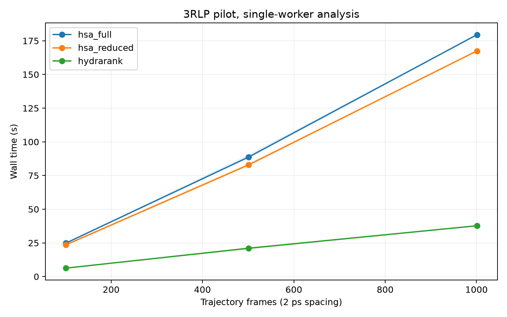
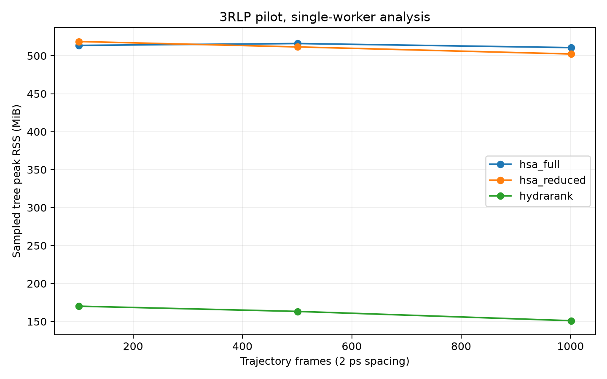
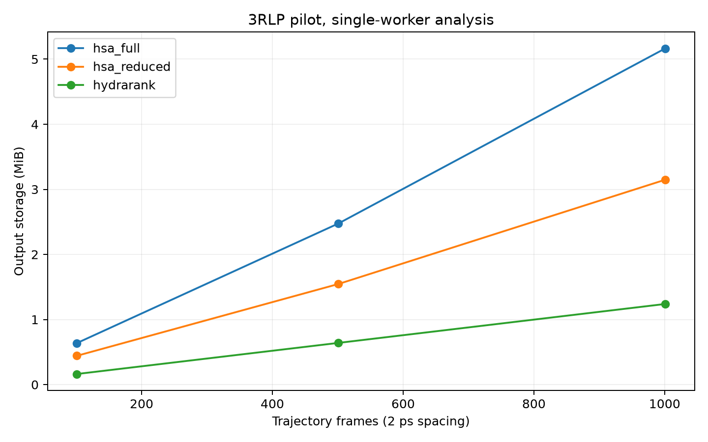

# 3RLP performance pilot

This report concerns short trajectory prefixes and computational performance. It does not establish scientific convergence or a full-trajectory speedup.

Host: Mac14,2, 8 logical CPUs, 16 GiB RAM. Separate installed Python/dependency environments are part of the comparison.

## Measured analysis costs

| Mode | Frames | Workers | Repeats | Median wall s | Range s | Tree peak MiB | OS peak MiB | Output MiB |
|---|---:|---|---:|---:|---:|---:|---:|---:|
| hsa_full | 101 | single | 3 | 24.88 | 24.33–25.03 | 513.6 | 513.2 | 0.6 |
| hsa_full | 501 | native | 1 | 89.92 | 89.92–89.92 | 516.9 | 516.5 | 2.5 |
| hsa_full | 501 | single | 3 | 88.71 | 88.13–90.57 | 516.1 | 518.1 | 2.5 |
| hsa_full | 1001 | single | 1 | 179.52 | 179.52–179.52 | 510.7 | 514.6 | 5.2 |
| hsa_reduced | 101 | single | 3 | 23.53 | 23.04–24.45 | 518.8 | 518.4 | 0.4 |
| hsa_reduced | 501 | native | 1 | 83.40 | 83.40–83.40 | 515.2 | 514.8 | 1.5 |
| hsa_reduced | 501 | single | 3 | 82.92 | 82.20–84.17 | 511.6 | 512.2 | 1.5 |
| hsa_reduced | 1001 | single | 1 | 167.50 | 167.50–167.50 | 502.3 | 514.1 | 3.1 |
| hydrarank | 101 | single | 3 | 6.27 | 6.19–6.42 | 170.2 | 169.2 | 0.2 |
| hydrarank | 501 | native | 1 | 21.30 | 21.30–21.30 | 177.3 | 176.3 | 0.6 |
| hydrarank | 501 | single | 3 | 21.04 | 20.05–21.56 | 163.3 | 162.8 | 0.6 |
| hydrarank | 1001 | single | 1 | 37.72 | 37.72–37.72 | 151.1 | 152.0 | 1.2 |

## CPU use and stages

| Mode at 1,001 frames, single worker | Frames/s | CPU s/frame | Peak processes | Peak threads |
|---|---:|---:|---:|---:|
| hsa_full | 5.58 | 0.1781 | 2 | 3 |
| hsa_reduced | 5.98 | 0.1656 | 2 | 2 |
| hydrarank | 26.54 | 0.0369 | 2 | 2 |

Stage timings are inclusive; nested stages must not be added to their parents. External elapsed time is authoritative. Stage totals can differ from external elapsed time because timing boundaries and clocks differ.

| Mode at 1,001 frames | Stage | Depth | Inclusive s |
|---|---|---:|---:|
| hydrarank | load_universe | 0 | 0.224 |
| hydrarank | describe_system | 0 | 0.226 |
| hydrarank | prepare_system | 1 | 1.900 |
| hydrarank | run_preprocess | 0 | 36.031 |
| hydrarank | cluster_hydration_sites | 0 | 0.554 |
| hydrarank | translational_entropy | 1 | 0.009 |
| hydrarank | orientational_entropy | 1 | 0.031 |
| hydrarank | analyse_sites | 0 | 0.058 |
| hydrarank | rank_sites | 0 | 0.000 |
| hydrarank | _write_artifacts | 0 | 0.007 |
| hsa_full | initialization | 0 | 4.058 |
| hsa_full | clustering | 0 | 3.178 |
| hsa_full | generate_data_for_entropycalcs | 1 | 0.191 |
| hsa_full | run_entropy_scripts | 1 | 0.155 |
| hsa_full | normalize_site_quantities | 1 | 0.009 |
| hsa_full | site_quantities | 0 | 170.042 |
| hsa_full | export | 0 | 0.088 |
| hsa_reduced | initialization | 0 | 4.045 |
| hsa_reduced | clustering | 0 | 3.480 |
| hsa_reduced | generate_data_for_entropycalcs | 1 | 0.204 |
| hsa_reduced | run_entropy_scripts | 1 | 0.158 |
| hsa_reduced | normalize_site_quantities | 1 | 0.006 |
| hsa_reduced | site_quantities | 0 | 158.044 |
| hsa_reduced | export | 0 | 0.024 |

SSTMap's entropy-script timing includes its compiled subprocesses, but collecting entropy inputs also occurs within the site-calculation loop. The script timing alone is not the complete cost of obtaining entropy. These stage timings do not isolate equivalent entropy workloads across tools.

## Cache reuse

HydraRank at 501 frames: complete, 1.33 s, cache reuse verified: True. This trial is excluded from fresh-analysis ratios and projections.

## Validation and failures

- hydrarank: complete. 
- hsa_full: complete. 
- hsa_reduced: complete. 
- gist_full: failed. SIGSEGV in native voxel assignment; see ../GIST_BLOCKER.md and preserved diagnostic logs.
- gist_entropy: failed. SIGSEGV in native voxel assignment; see ../GIST_BLOCKER.md and preserved diagnostic logs.

The intended 0.5 Å GIST box spans [31.0, 32.0, 31.5] to [49.0, 49.5, 47.0] Å, with dimensions [36, 35, 31] and volume 4882.5 ų. An independent Cartesian count over 1001 prepared frames found 33.9 oxygen atoms per frame on average (range 27–40). These are reference box counts, not validated GIST voxel assignments; GIST sampled counts remain unavailable.

Preparation of the 1,001-frame raw and aligned prefixes plus validation took 17.21 s. Stage timings distinguish raw-prefix export, alignment initialization, and alignment/export. Raw-prefix export is a benchmarking convenience, not part of SSTMap's scientific preparation requirement.
Preparation resource use is separate from analysis. The existing historical aligned trajectory was checked at representative frames in a common rigid coordinate frame.

## Preparation and combined cost

The measured alignment preparation stages for 1,001 frames total 12.96 s; this includes trajectory export and excludes raw-prefix export and validation. This is a single measurement, not a repeated preparation benchmark.

| Mode, single worker | Analysis at 1,001 frames s | Alignment preparation s | Combined s |
|---|---:|---:|---:|
| hsa_full | 179.52 | 12.96 | 192.48 |
| hsa_reduced | 167.50 | 12.96 | 180.46 |
| hydrarank | 37.72 | 0.00 | 37.72 |

HydraRank already includes alignment. SSTMap initialization and Python startup are included in its analysis time; preparation-stage totals omit their own interpreter startup. The summed cost is therefore an explicitly defined estimate of the combined stages, not an independently measured end-to-end SSTMap command.

## Projected full-study cost

The following planning envelopes extrapolate from the largest completed single-worker prefix. They are not measured full-trajectory runtimes. Lower bounds scale wall time linearly with frame count; upper bounds use twice that projection. Nonlinear entropy/clustering costs, memory growth, and grid volume can invalidate these estimates.

| Mode | Largest measured frames | Projected 25,001-frame run | Three-repeat frame-scaling campaign |
|---|---:|---:|---:|
| hsa_full | 1001 | 74.7–149.5 min | 6.59–13.18 h |
| hsa_reduced | 1001 | 69.7–139.4 min | 6.15–12.30 h |
| hydrarank | 1001 | 15.7–31.4 min | 1.39–2.77 h |

Frame-scaling subtotal for validated modes: 14.13–28.25 hours, excluding native-worker runs, cache trials, grid-region studies, preparation, and any blocked modes.
Memory projections are not assumed linear. Full runs must retain the half-RAM safety limit and report any infeasible configurations.

## Interpretation and limits

- Historical full SSTMap HSA: 83 min 55 s for 25,001 frames; clustering 88.18 s; site calculations 4,935.28 s. These are separate historical measurements without resource monitoring or repetitions.
- HSA and HydraRank use related site representations; the reduced HSA workflow is overlapping functionality, not identical functionality. Native clustering may give different site counts.
- GIST targets the ligand bounding box plus padding, including more solvent than the 5 Å ligand-distance region. Both modes crashed before output metadata was finalized; sampled grid-water counts are unavailable and must be measured after the native blocker is resolved.
- Analysis-only SSTMap measurements exclude alignment; preparation must be added for a raw-input comparison. HydraRank includes its local alignment during preprocessing.
- Single-worker trials override HydraRank KD-tree workers and limit numerical libraries. Native trials remove those limits; actual observed thread peaks are reported.
- OS peak RSS and sampled aggregate process-tree RSS measure different quantities; the latter can miss short-lived peaks between 0.5 s samples and double-count shared memory.
- Output storage excludes the original simulation inputs and includes logs and tool-local caches, but excludes resource-monitor JSON written after the timed process exits. Sampled peak disk usage can miss temporary files removed between scans.
- Shared trajectory-index caches were generated during input preparation and preflight; they are retained across trials. Fresh-cache comparisons refer to observations and per-trial runtime caches, not rebuilding shared trajectory indices.
- CPU times include waited descendants. Page faults and block-operation counters are OS-specific; they do not measure physical storage throughput.
- Each trial uses a new directory and a fresh process. Input prefixes are read before timing; no disk-cold or fully idle-host claim is made. Diagnostic and report-development activity occurred during parts of the pilot; repeat full-study measurements on an otherwise idle host.
- Monitor microbenchmark median elapsed difference: -1.6% across three paired runs. Scheduling noise and startup cost limit this estimate; inspect raw trials rather than treating it as a correction factor.
- The installed GIST voxel-assignment extension hardcodes 0.5 Å. The 0.25/1.0 Å resolution study is blocked pending a documented, validated correction.
- Cached HydraRank trials are labelled separately and excluded from primary summaries and projections.

The full study remains pending user review. Do not replace these planning estimates with manuscript claims of full-trajectory speed.

## Figures

