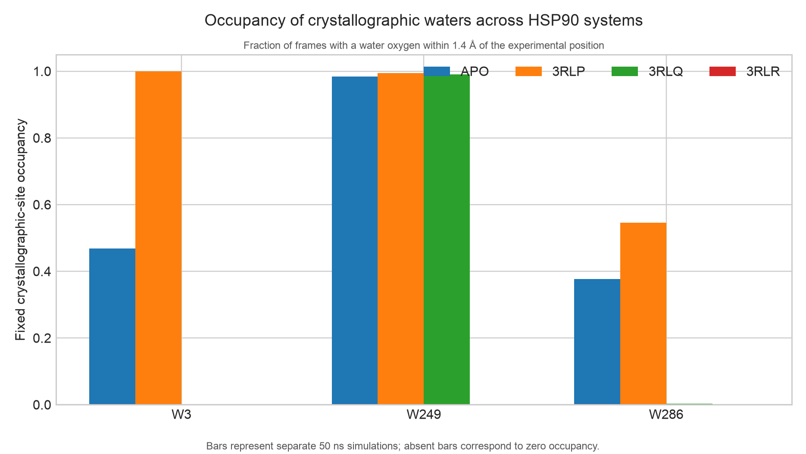
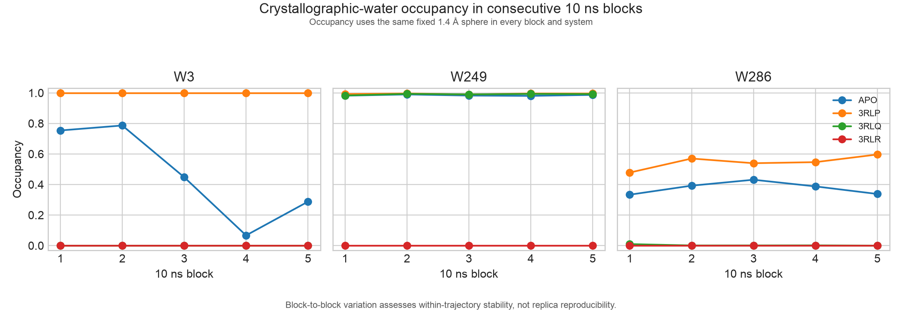
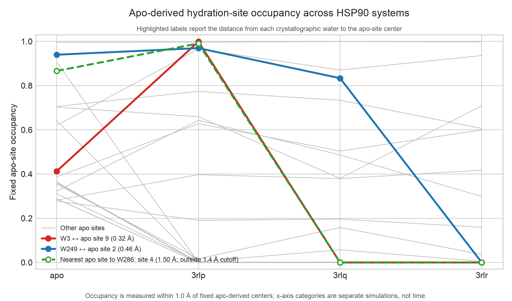
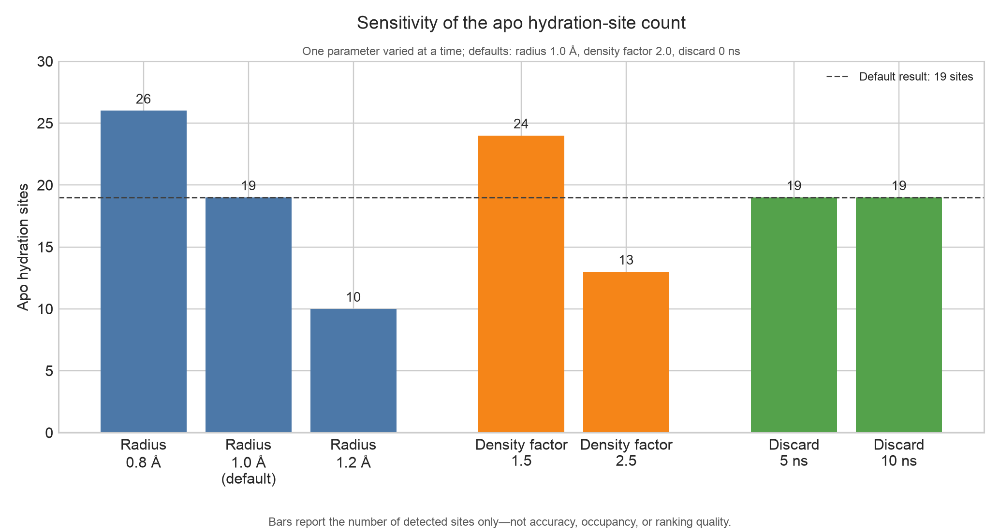

# HSP90 apo–holo validation summary

## Scope

This analysis tests whether an apo HydraRank map anticipates the water-displacement
sequence in the congeneric HSP90 structures 3RLP, 3RLQ, and 3RLR. Kung et al. reported
that formation of the fused pyrrole ring from 3RLP to 3RLQ displaces W3 while retaining
important polar interactions, and that the additional methyl group in 3RLR displaces
W249 and W286 with a smaller potency improvement. The comparison is retrospective and
qualitative: three complexes cannot support a fitted affinity model.

All four trajectories contain 25,001 frames at 2 ps spacing (50 ns) and were analysed at
303.15 K. The apo calculation uses the 3RLP ligand pose only as a non-interacting spatial
reference. The original trajectories and HydraRank outputs were not modified.

## Common reference frame

The four HydraRank coordinate systems were superposed on the 3RLP frame using the same
61 pocket Cα atoms. Local-fit RMSDs were 0.36 Å for apo, 0.90 Å for 3RLQ, and 0.98 Å for
3RLR. The corresponding crystallographic-to-simulation fits were 0.87, 0.28, and 0.32 Å,
respectively. These values are small relative to the 1.0 Å hydration-site radius, although
they remain part of the uncertainty of exact crystal-site matching.

## Recovery of crystallographic waters

At a predeclared 1.4 Å one-to-one matching threshold, the holo HydraRank maps recovered
11/12 (92%) nearby crystallographic waters for 3RLP, 11/12 (92%) for 3RLQ, and 9/12
(75%) for 3RLR. The apo map recovered 10/12 (83%) of the 3RLP crystallographic waters.
Precision ranged from 53% to 65% because HydraRank also reports dynamically populated
sites without a deposited crystal-water counterpart; this is not, by itself, evidence of
a false prediction.

## Paper-highlighted waters

Fixed-site occupancy was measured around the experimental water coordinates after
placing every trajectory in the common frame. Values below use a 1.4 Å sphere.

| water | apo | 3RLP | 3RLQ | 3RLR | interpretation |
|---|---:|---:|---:|---:|---|
| W3 | 0.469 | 1.000 | 0.000 | 0.000 | Reproduces displacement by the fused 3RLQ/3RLR scaffold. |
| W249 | 0.984 | 0.994 | 0.991 | 0.000 | Reproduces retention through 3RLQ and displacement in 3RLR. |
| W286 | 0.377 | 0.546 | 0.003 | 0.000 | Not recovered in 3RLQ conventional MD; cannot validate the reported 3RLQ→3RLR displacement. |

*Figure 1. Fixed crystallographic-site occupancy. Each bar is the fraction of frames in
which a water oxygen lies within 1.4 Å of the experimental W3, W249, or W286 position after
alignment to the common pocket frame. The four bars in each group are independent 50 ns
simulations, not consecutive time points. Zero occupancy means that no analysed frame
contains a water in the specified sphere.*

The listed apo values are means of five 10 ns blocks. W3 is nonstationary in the apo
trajectory (block occupancies 0.754, 0.787, 0.448, 0.067, and 0.288), whereas W249 is
stable (0.982–0.990). The W3 holo result is nevertheless unambiguous: occupancy is 1.000
in every 3RLP block and zero in every 3RLQ and 3RLR block because the larger ligands
sterically occupy the site. W286 remains essentially empty in every 3RLQ block. Later
work on these systems likewise found that conventional MD can fail to rehydrate one of
the two target sites in 3RLQ and noted weak experimental density at the difficult site;
the present result should therefore be treated as a sampling limitation, not silently
converted into agreement.

*Figure 2. Within-trajectory occupancy stability. Each trajectory is divided into five
consecutive 10 ns blocks, and occupancy is recalculated in the same fixed 1.4 Å sphere.
W249 is stable, apo W3 is nonstationary, and W286 remains essentially empty throughout
3RLQ. This is a block-convergence diagnostic and does not replace independent replicas.*

## Apo ranking and ligand coverage

The W3 coordinate maps to apo site 9 (0.32 Å), which is ranked third and labelled
`displaceable`. W249 maps to apo site 2 (0.46 Å), ranked twelfth and labelled
`replace-hbonds`; this correctly warns that favourable polar interactions should be
replaced rather than merely removing the water. W286 lies 1.50 Å from the nearest apo
site and is not a robust site-level match at the 1.4 Å threshold.

*Figure 3. Occupancy of the 19 fixed apo-derived hydration-site centers across the four
simulations, measured using a 1.0 Å assignment radius. W3 maps to apo site 9 and W249 to
apo site 2. Apo site 4 is only the nearest detected site to W286: its 1.50 Å separation
exceeds the 1.4 Å crystallographic matching threshold and is therefore shown as an
unvalidated correspondence. Lines connect separate simulations, not a time series.*

The apo scores of sites sterically occupied by each ligand sum to 11.29 kcal/mol for
3RLP, 17.91 kcal/mol for 3RLQ, and 17.75 kcal/mol for 3RLR. This agrees with the reported
large improvement on going from 3RLP to 3RLQ, but it does not predict an additional gain
for 3RLR. That is an informative limitation: HydraRank's score is a prioritization
heuristic, not a binding-affinity estimator, and it omits ligand strain, interaction
energies, protein reorganization, and solvent correlations.

Crystal-structure polar contacts provide a chemically plausible replacement mechanism.
All three ligands directly contact Asp93 through a ring nitrogen (2.62–2.74 Å heavy-atom
distance); the fused 3RLQ and 3RLR ligands additionally place N4 near Asn51 (3.20–3.33 Å).
These are heavy-atom contacts rather than angle-validated hydrogen-bond assignments.

## Sensitivity and convergence

- Discarding the first 5 or 10 ns leaves 19 apo sites and keeps W3 and W249 centers within
  0.48 Å of their crystal coordinates. It does not recover W286.
- Changing the site radius from 0.8 to 1.2 Å changes the site count from 26 to 10. W3 is
  lost as a distinct site at 1.2 Å, demonstrating that fine-grained site identity is
  radius-dependent even though the fixed crystallographic-site occupancy conclusion is
  unchanged.
- Density factors of 1.5–2.5 produce 24–13 sites. The W3 and W249 peak positions remain
  stable, while W286 remains unmatched.
- Changing the hydrogen-bond penalty from 0.5 to 1.5 kcal/mol gives rank correlations of
  0.82–0.87 relative to the default and can change the top-ranked site. Categories and
  exact rank order should therefore be interpreted more cautiously than large occupancy
  differences or steric overlap.

*Figure 4. One-factor-at-a-time sensitivity of the number of detected apo hydration sites.
The defaults are a 1.0 Å site radius, density factor 2.0, and no discarded trajectory time,
which produce 19 sites. Smaller radii and lower density thresholds resolve more sites;
larger radii and stricter thresholds resolve fewer. Discarding the first 5 or 10 ns leaves
the count unchanged. Site count alone is not a measure of accuracy, occupancy, entropy, or
ranking quality.*

## Conclusion

HydraRank passes the most important retrospective structural test: an apo-derived map
identifies the W3 and W249 sites, assigns them chemically distinct priorities, and their
fixed-site occupancies change in the ligand series as reported experimentally. The test
also exposes two real limitations: W286 is not adequately sampled
in 3RLQ conventional MD, and the apo W3 population drifts substantially over 50 ns.

This is evidence that HydraRank can generate useful, interpretable water-displacement
hypotheses. It is not yet evidence of prospective affinity prediction. Independent apo
and holo replicas, enhanced water sampling for W286, and a larger ligand series would be
needed for that stronger claim.

## Reproducibility

Run `.venv/bin/python validation/hsp90/run_validation.py` from the repository root.
`manifest.json` records hashes of the script, configurations, and HydraRank result files.
The CSV tables contain all values used above, and the `figures` directory contains the
generated plots.
